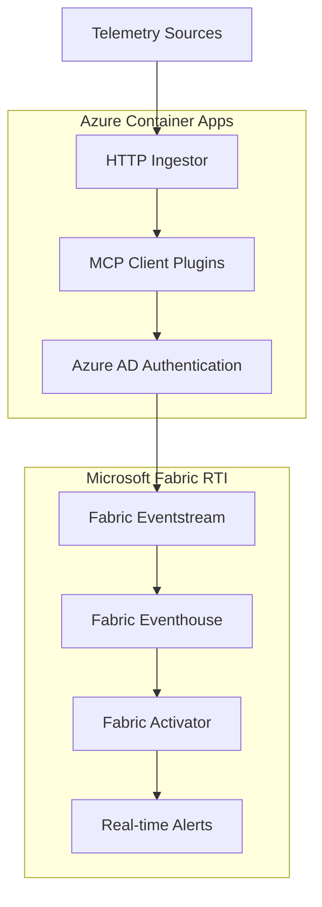

# Microsoft Fabric RTI + MCP Telemetry Client

[](https://opensource.org/licenses/MIT)
[](https://azure.microsoft.com/en-us/products/azure-resource-manager/)
[](https://www.microsoft.com/en-us/microsoft-fabric)
[](https://github.com/karthiksivaramms/mcp-telemetry-client)

> 🚀 **Open Source Infrastructure as Code** for deploying Microsoft Fabric Real-Time Intelligence (RTI) with automated telemetry ingestion using the Model Context Protocol (MCP) client architecture.

## 🎯 What This Project Does

This repository provides a complete, production-ready solution for:

- **🏗️ Infrastructure as Code**: Deploy Microsoft Fabric RTI resources (Eventstream, Eventhouse, Activator) using Azure Bicep templates
- **📊 Telemetry Ingestion**: Node.js HTTP server that accepts any telemetry data and forwards it to Fabric Eventstream
- **🔌 MCP Integration**: Extensible architecture supporting the [MCP Telemetry Client](https://github.com/karthiksivaramms/mcp-telemetry-client) for schema adapters and data pipelines
- **🚢 Container Deployment**: Fully containerized solution deployable to Azure Container Apps
- **⚙️ CI/CD Automation**: GitHub Actions workflows for automated builds and deployments

## 📁 Repository Structure

```
fabric-rti-mcp/
├── 📂 infra/                    # Azure Bicep Infrastructure Templates
│   ├── main.bicep              # Fabric RTI resources (Eventstream, Eventhouse, Activator)
│   ├── container.bicep         # Azure Container Apps infrastructure
│   └── *.parameters.json       # Environment-specific parameters
├── 📂 app/telemetry-ingestor/   # Node.js Telemetry Server
│   ├── src/index.js           # HTTP server with MCP plugin support
│   ├── Dockerfile             # Multi-stage container build
│   └── package.json           # Dependencies and scripts
├── 📂 .github/workflows/        # CI/CD Automation
│   ├── deploy-infra.yml       # Infrastructure deployment
│   ├── build-and-release.yml  # Container build and deployment
│   └── fabric-provision.yml   # Fabric workspace provisioning
├── 📂 tools/fabric-provision/   # Fabric REST API Scripts
│   └── index.js               # Workspace and RTI item creation
├── 📄 README.md               # This file
└── 📄 LICENSE                 # MIT License
```

## 🚀 Quick Start

### Prerequisites

- **Azure Subscription** with Contributor permissions
- **GitHub Repository** with OIDC configured
- **Microsoft Fabric** trial or paid capacity (for RTI features)
- **Node.js 18+** (for local development)

### 1. Fork & Configure

1. **Fork this repository** to your GitHub account
2. **Configure GitHub Secrets** in your repository settings:
   ```
   AZURE_TENANT_ID=your-azure-tenant-id
   AZURE_CLIENT_ID=your-service-principal-client-id
   AZURE_SUBSCRIPTION_ID=your-azure-subscription-id
   ```
3. **Optional Fabric Secrets** (for automated provisioning):
   ```
   FABRIC_TENANT_ID=your-fabric-tenant-id
   FABRIC_CLIENT_ID=your-fabric-app-client-id
   FABRIC_CLIENT_SECRET=your-fabric-app-secret
   ```

### 2. Deploy Infrastructure

**Option A: Automatic Deployment (Recommended)**
```bash
# Push changes to trigger deployment
git add .
git commit -m "Initial deployment"
git push origin main
```

**Option B: Manual Deployment**
```powershell
# Login to Azure
az login
az account set --subscription <your-subscription-id>

# Create resource group
az group create --name rg-fabric-rti-mcp --location eastus

# Deploy container infrastructure
az deployment group create \
  --resource-group rg-fabric-rti-mcp \
  --template-file infra/container.bicep \
  --parameters @infra/container.parameters.json

# Deploy Fabric RTI resources (requires Fabric capacity)
az deployment group create \
  --resource-group rg-fabric-rti-mcp \
  --template-file infra/main.bicep \
  --parameters @infra/main.parameters.json
```

### 3. Deploy Container Application

Create a GitHub release to trigger container build and deployment:
```bash
git tag v1.0.0
git push origin v1.0.0
```

## 📊 Usage Examples

### HTTP Telemetry Ingestion

```bash
# Health check
curl https://your-app-url.azurecontainerapps.io/health

# Send telemetry data
curl -X POST https://your-app-url.azurecontainerapps.io/ingest \
  -H "Content-Type: application/json" \
  -d '{
    "timestamp": "2025-01-15T10:00:00Z",
    "source": "web-app",
    "metric": "page_views",
    "value": 1,
    "tags": {
      "page": "/dashboard",
      "user_id": "12345"
    }
  }'
```

### Local Development

```powershell
cd app/telemetry-ingestor

# Copy environment template
copy .env.example .env

# Install dependencies
npm install

# Run in development mode
npm run dev

# Test with example data
npm start -- --example
```

### MCP Client Integration

This project integrates with the [MCP Telemetry Client](https://github.com/karthiksivaramms/mcp-telemetry-client) for advanced data processing:

```javascript
// Example MCP plugin usage
const mcpClient = require('./src/mcp-client');

// Register custom data transformation
mcpClient.registerPlugin('normalize-metrics', (data) => {
  return {
    ...data,
    timestamp: new Date(data.timestamp).toISOString(),
    normalized: true
  };
});
```

## 🏗️ Architecture



## 🔧 Configuration

### Environment Variables

| Variable | Description | Required | Default |
|----------|-------------|----------|---------|
| `EVENTSTREAM_INGEST_URL` | Fabric Eventstream ingestion endpoint | Yes | - |
| `AZURE_TENANT_ID` | Azure AD tenant ID | Yes | - |
| `AZURE_CLIENT_ID` | Managed identity client ID | Yes | - |
| `PORT` | HTTP server port | No | 3000 |
| `LOG_LEVEL` | Logging level (debug, info, warn, error) | No | info |
| `MCP_PLUGINS_PATH` | Path to MCP plugin directory | No | ./plugins |

### Fabric RTI Setup

1. **Start Fabric Trial** or ensure you have a paid Fabric capacity
2. **Create Workspace** (or use existing PowerBI workspace)
3. **Provision RTI Items**:
   - Eventstream for data ingestion
   - Eventhouse for data storage
   - Activator for real-time alerts

Use the automated provisioning workflow or run:
```powershell
cd tools/fabric-provision
npm install
npm run provision
```

## 🤝 Contributing

We welcome contributions! Please see our [Contributing Guidelines](CONTRIBUTING.md) for details.

### Development Setup

1. **Fork** the repository
2. **Clone** your fork: `git clone https://github.com/YOUR-USERNAME/fabric-rti-mcp.git`
3. **Install dependencies**: `npm install` (in app/telemetry-ingestor)
4. **Create a branch**: `git checkout -b feature/your-feature-name`
5. **Make changes** and test locally
6. **Submit a pull request**

### Code Style

- Use ESLint configuration in `.eslintrc.js`
- Follow Bicep best practices for infrastructure
- Add JSDoc comments for all functions
- Include unit tests for new features

## 📝 API Reference

### POST /ingest

Accepts telemetry data and forwards to Fabric Eventstream.

**Request Body:**
```json
{
  "timestamp": "ISO 8601 timestamp",
  "source": "string",
  "metric": "string", 
  "value": "number|string",
  "tags": {
    "key": "value"
  }
}
```

**Response:**
```json
{
  "status": "success",
  "message": "Data ingested successfully",
  "id": "unique-event-id"
}
```

### GET /health

Returns service health status.

**Response:**
```json
{
  "status": "healthy",
  "timestamp": "2025-01-15T10:00:00Z",
  "version": "1.0.0"
}
```

## 🐛 Troubleshooting

### Common Issues

**1. Fabric Capacity Required**
```
Error: RTI items require Fabric trial or paid capacity
Solution: Start Fabric trial at https://fabric.microsoft.com
```

**2. Authentication Failed**
```
Error: Failed to authenticate with Azure AD
Solution: Check AZURE_TENANT_ID and AZURE_CLIENT_ID environment variables
```

**3. Container Build Failed**
```
Error: Docker build failed in GitHub Actions
Solution: Check GitHub OIDC configuration and Azure permissions
```

### Debug Mode

Enable debug logging:
```bash
export LOG_LEVEL=debug
npm start
```

### Support

- 📖 [Documentation](docs/)
- 🐛 [Issues](https://github.com/YOUR-USERNAME/fabric-rti-mcp/issues)
- 💬 [Discussions](https://github.com/YOUR-USERNAME/fabric-rti-mcp/discussions)

## 📄 License

This project is licensed under the MIT License - see the [LICENSE](LICENSE) file for details.

## 🙏 Acknowledgments

- [Microsoft Fabric Team](https://www.microsoft.com/en-us/microsoft-fabric) for the RTI platform
- [MCP Telemetry Client](https://github.com/karthiksivaramms/mcp-telemetry-client) for the integration framework
- [Azure Bicep Team](https://github.com/Azure/bicep) for Infrastructure as Code tooling

## 🔗 Related Projects

- [MCP Telemetry Client](https://github.com/karthiksivaramms/mcp-telemetry-client) - Schema adapters and data pipelines
- [Azure Bicep](https://github.com/Azure/bicep) - Infrastructure as Code for Azure
- [Microsoft Fabric Samples](https://github.com/microsoft/fabric-samples) - Official Fabric examples

---

⭐ **Star this repository** if you find it useful!
